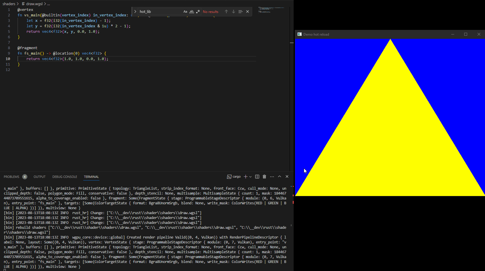

# Rust WGPU hot-reload

Hot reload both shaders and Rust code while developing a WGPU application.

## How to use

The project is divided in two crates: `lib` and `src`. `lib` is built as a dll and reloaded at runtime.
Entry point functions should be written in `lib.rs`, be public and have the `#[no_mangle]` attribute to be hot-reloadable.
Then each include to the lib should be done via the module `hot_lib::library_bridge`.

## Running the project

- To run native release, run `cargo run --release`
- To run native debug with shader hot reload only, run `cargo run`
- To run native debug with shader and rust hot reload, run `cargo run --features reload` in one terminal and `cargo watch -w lib -x "rustc --crate-type=dylib -p lib"` in another terminal. Alternatively, use [cargo-runcc](https://crates.io/crates/runcc) [cargo-watch](https://github.com/watchexec/cargo-watch) and `cargo runcc -c runcc.yml` to run both commands at the same time.
- To run wasm build, see below.

## Building for the web

First install the version of wasm-bindgen-cli that matches the version used by wgpu:
`cargo install -f wasm-bindgen-cli --version 0.2.87`

Then build the example for wasm32-unknown-unknown and run `wasm-bindgen` on the output:
`RUSTFLAGS=--cfg=web_sys_unstable_apis cargo build --target wasm32-unknown-unknown`

And generate wasm bindings:
`wasm-bindgen --out-dir target/generated --web target/wasm32-unknown-unknown/debug/wgpu-hot-reload.wasm`

As of 2023-08-14, wegbpu is available in chromium-based browsers and in firefox nightly behind a flag. See [webgpu.io](https://webgpu.io) for up to date browser implementation status. If WebGL2 is not enough and you need WebGPU, you need to add the flag `RUSTFLAGS=--cfg=web_sys_unstable_apis` before compiling.

Copy the `index.html` file in `target/generated` directory and add the following code:

Finally run a web server locally inside the `target/generated` directory to see the project in the browser. Examples of servers are rust's
[`simple-http-server target/generated`](https://crates.io/crates/simple-http-server),
[`miniserve target/generated`](https://crates.io/crates/miniserve), or other languages
`ruby -run -e httpd -p 8000 target/generated`.
Python's debug server (`python -m http.server target/generated`) may have issues with MIME types causing failures.

## References:
- See [hot-lib-reloader-rs](https://github.com/rksm/hot-lib-reloader-rs) for more information about hot reloading Rust code.
- [wgpu](https://github.com/gfx-rs/wgpu)
